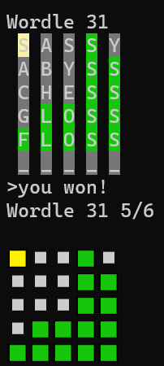

# termle
[Wordle](https://www.powerlanguage.co.uk/wordle/) in the Terminal. termle.



```shell
go install github.com/JeremyLoy/termle@latest

termle # plays current day
termle -random # plays a random day
termle -day 215 # play a day by number
```